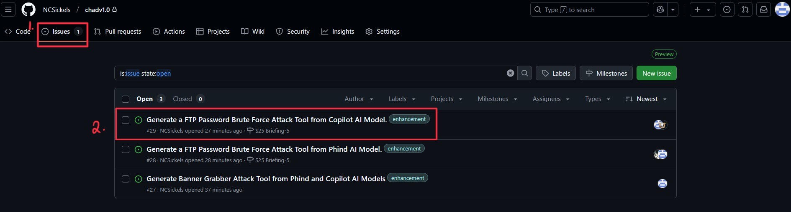
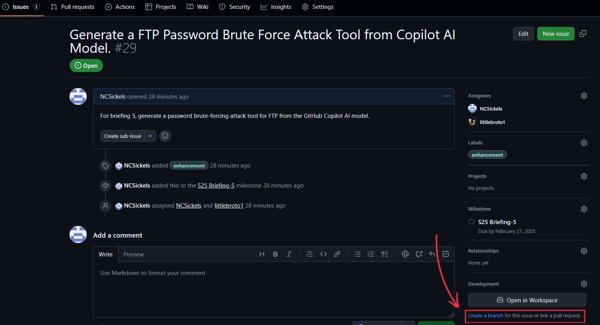
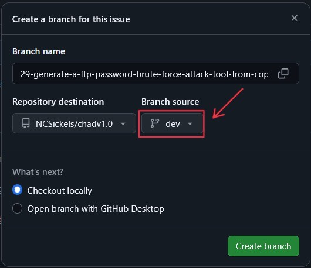
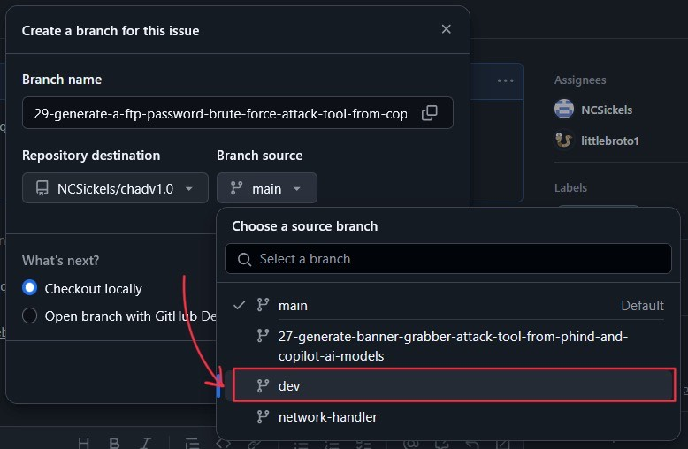
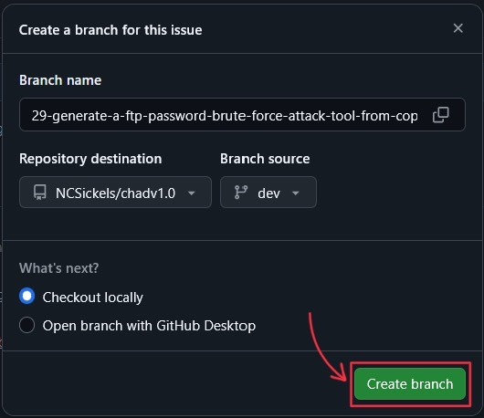
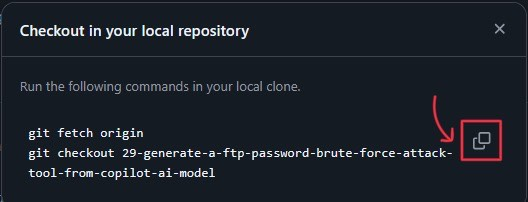

# GitHub Commit, Branch, and Issues Convention Guide

## Commit Convention Overview

### Message Structure Summary

1. Commit Message Structure
    - Header: A short summary of the changes (50 characters or less).
    - Body: Detailed explanation of the changes (optional, 72 characters per line).
    - Footer: References to issues or breaking changes (optional).
2. Header Format:

    - `<type>(<scope>): <subject>`
    - Type: Describes the kind of change (e.g., feat, fix, docs, style, refactor, test, chore).
    - Scope: The part of the codebase affected (optional).
    - Subject: A brief description of the change.

### Example

```git
feat(auth): add login functionality

Added the login functionality to the authentication module.
This includes the login form and API integration.

Closes #123
```

## Creating a New Branch from a GitHub Issue

### Overview Summary

1. Go to the GitHub repository and navigate to the issue you want to work on.

2. Under the issue, find the "Development" section and click on the "Create a branch" option.

3. In the pop-up window, change the default branch name if needed and click "Create branch" to create a new branch. For Chad, we will select the "Dev" branch.


4. Select the "Create Branch" button to create the new branch from the issue.

5. After creating the branch, copy the dialog box's text and paste into the terminal to switch to the new branch.

