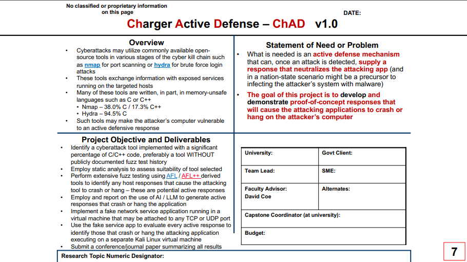

# Charger Active Defense v1.0 - Senior Design Project

 *Noah Sickels, Adam Brannon, and William Lochte*



## Project Directory Structure

<details>

```plaintext
Charger Active Defense v1.0 - Senior Design Project
.
├── README.md
├── config
│   ├── Metasploitable2_Running_Services.txt
│   └── Testbed_Config.md
├── deliverables
│   ├── Conference-template-A4.doc
│   ├── G12_attack_tool_selection_report.docx
│   ├── G12_fuzz_tool_selection_report.docx
│   ├── G12_fuzzing_results_analysis.docx
│   ├── G12_updated_milestones.docx
│   ├── G12_updated_timeline.png
│   ├── Project_Timeline_v2.gan
│   ├── briefings
│   │   ├── brief_1
│   │   │   ├── G12_briefing_1_progress_report.docx
│   │   ├── brief_2
│   │   │   ├── G12_briefing_2_progress_report.docx
│   │   │   └── fuzzowski_medusa_telnet.pcap
│   │   └── brief_3
│   │       └── G12_briefing_3_progress_report.docx
│   ├── design_review
│   │   ├── 495_488_design_review_template.pptx
│   │   ├── Behavioral_Decomposition.vsdx
│   │   ├── Functional_Decomposition.vsdx
│   │   ├── G12_design_review_presentation.pptx
│   │   ├── G12_level_of_effort.docx
│   │   ├── G12_marketing_requirements.docx
│   │   ├── Updated_Behavioral_Decomposition.png
│   │   ├── Updated_Functional_Decomposition.png
│   │   └── individual_level_of_effort.md
│   ├── final_report
│   ├── proposal
│   │   └── Project-Proposal-Submission.pdf
│   └── timeline_and_milestones
│       └── initial
│           ├── Project_Timeline_Proposal.gan
│           └── milestone_analysis.md
├── fuzzing
│   ├── afl-qemu-trace
│   ├── fuzzowski.medusa.ftp
│   │   └── ftp.py
│   ├── fuzzshark
│   │   └── src
│   │       ├── CMakeLists.txt
│   │       ├── FuzzerInterface.h
│   │       ├── StandaloneFuzzTargetMain.c
│   │       └── fuzzshark.c
│   ├── medusa.postgresql.afl_1
│   │   ├── cmdline
│   │   ├── fuzz_bitmap
│   │   ├── fuzzer_setup
│   │   ├── fuzzer_stats
│   │   ├── ~hangs
│   │   ├── init_attempt
│   │   │   ├── medusa_config.txt
│   │   │   ├── wrapper.c
│   │   │   └── wrapper.sh
│   │   ├── ~plot_data
│   │   └── ~queue
│   ├── peach_fuzz
│   │   ├── network_fuzzing.xml
│   │   └── peachfuzzer.dockerfile
│   ├── radamsa
│   │   ├── Radamsa_Instructions.md
│   │   └── ~img
│   ├── randbytes
│   │   ├── ftp_server.py
│   │   └── pcap_parsing.py
│   ├── randpkt
│   │   └── src
│   │       ├── CMakeLists.txt
│   │       ├── randpkt.c
│   │       ├── randpkt_core.c
│   │       └── randpkt_core.h
│   └── scapy.radamsa
│       └── radamsa_scapy_pcap_fuzzing.py
├── misc
│   ├── Attack_Tool_Commands.md
│   ├── Attack_Tool_Info.md
│   ├── password_list.txt
│   └── repeat_medusa.sh
├── pcaps
│   ├── baseline
│   │   ├── masscan.pcap
│   │   ├── medusa_ftp.pcap
│   │   ├── medusa_postgresql.pcap
│   │   └── medusa_ssh.pcap
│   └── scapy
│       ├── ftp_login_packets.pcap
│       ├── fuzz_test_1.pcap
│       ├── medusa_ftp_brute_force.pcap
│       ├── medusa_ftp_fail.pcap
│       └── nmap_ftp_scan.pcap
├── project_overview.png
├── research
│   ├── CVEs.md
│   ├── Fuzzing_Tools.md
│   └── cmiller-csw-2010.pdf
└── tests
    ├── ldra
    │   ├── aircrack-ng
    │   │   └── aircrack-ng.mts.htm
    │   ├── masscan
    │   │   └── masscan.mts.htm
    │   ├── medusa
    │   │   └── medusa.mts.htm
    │   ├── netdiscover
    │   │   └── netdiscover.mts.htm
    │   ├── reaver
    │   │   └── reaver.mts.htm
    │   └── yersinia
    │       └── yersinia.mts.htm
    └── valgrind
        ├── commands.txt
        ├── masscan.txt
        ├── medusa_ftp.txt
        ├── medusa_postgres.txt
        ├── medusa_ssh.txt
        └── netdiscover.txt
```

</details>

### Explanation

<details>

- **README.md:** This file.
- **project_overview.png:** Image of the project overview.
- **config:** Contains configuration files.
  - **Testbed_Config.md:** Configuration details for the testbed.
- **deliverables**: Contains project deliverables, including the tool reports, proposal presentation slides, briefings, design review, and final report.
  - **G12_attack_tool_selection_report.docx:** Attack tool selection report.
  - **G12_fuzz_tool_selection_report.docx:** Fuzz tool selection report.
  - **G12_fuzzing_results_analysis.docx:** Fuzzing results analysis.
  - **G12_updated_milestones.docx:** Updated milestones.
  - **G12_updated_timeline.png:** Updated timeline.
  - **Project_Timeline_v2.gan:** Gantt chart file for the project timeline.
  - **briefings:** Contains briefing files.
    - **brief_1:** Briefing 1 files.
      - **G12_briefing_1_progress_report.docx:** Briefing 1 progress report.
    - **brief_2:** Briefing 2 files.
      - **G12_briefing_2_progress_report.docx:** Briefing 2 progress report.
      - **fuzzowski_medusa_telnet.pcap:** Fuzzowski Medusa Telnet PCAP file.
    - **brief_3:** Briefing 3 files.
      - **G12_briefing_3_progress_report.docx:** Briefing 3 progress report.
  - **design_review:** Contains design review files.
    - **495_488_design_review_template.pptx:** Design review template.
    - **Behavioral_Decomposition.vsdx:** Behavioral decomposition Visio diagram.
    - **Functional_Decomposition.vsdx:** Functional decomposition Visio diagram.
    - **G12_design_review_presentation.pptx:** Design review presentation.
    - **G12_level_of_effort.docx:** Level of effort document.
    - **G12_marketing_requirements.docx:** Marketing requirements document.
    - **Updated_Behavioral_Decomposition.png:** Updated behavioral decomposition diagram image.
    - **Updated_Functional_Decomposition.png:** Updated functional decomposition diagram image.
    - **individual_level_of_effort.md:** Individual level of effort document.
  - **final_report:** Final report files.
  - **proposal:** Proposal files.
    - **Project-Proposal-Submission.pdf:** Project proposal presentation slides.
  - **timeline_and_milestones:** Contains timeline and milestones files.
    - **initial:** Initial timeline and milestones.
      - **Project_Timeline_Proposal.gan:** Initial project timeline proposal.
      - **milestone_analysis.md:** Milestone analysis.  
- **fuzzing:** Contains fuzzing-related files.
  - **afl-qemu-trace:** AFL QEMU trace binary.
  - **fuzzowski.medusa.ftp:** Fuzzowski Medusa FTP files.
    - **ftp.py:** FTP file for Fuzzowski Medusa.
  - **fuzzshark:** Fuzzshark files.
  - **medusa.postgresql.afl_1:** Medusa PostgreSQL AFL files.
    - **init_attempt:** Initial attempts with AFLnet.
      - **medusa_config.txt:** Medusa configuration file for wrapper.
      - **wrapper.c:** Custom wrapper source file.
      - **wrapper.sh:** Custom wrapper script.
  - **peach_fuzz:** Peach Fuzz files.
    - **network_fuzzing.xml:** Network fuzzing XML model file.
    - **peachfuzzer.dockerfile:** Peach Fuzzer Dockerfile.
  - **radamsa:** Radamsa files.
    - **Radamsa_Instructions.md:** Radamsa testing instructions.
  - **randbytes:** Randbytes files.
    - **ftp_server.py:** FTP server file.
    - **pcap_parsing.py:** PCAP parsing file.
  - **randpkt:** Randpkt files.
  - **scapy.radamsa:** Scapy Radamsa files.
    - **radamsa_scapy_pcap_fuzzing.py:** Radamsa & Scapy PCAP fuzzing Python script.
- **misc:** Miscellaneous files.
  - **Attack_Tool_Commands.md:** Commands for attack tools used during compatibility testing.
  - **Attack_Tool_Info.md:** Information about attack tools.
  - **password_list.txt:** Password list used for testing.
  - **repeat_medusa.sh:** Script to repeatedly run Medusa.
- **pcaps:** Contains PCAP files.
  - **baseline:** Baseline PCAP files.
  - **scapy:** Scapy PCAP files.
- **tests:** Contains test-related files.
  - **ldra:** LDRA test files.
    - **aircrack-ng/aircrack-ng.mts.htm:** Aircrack-ng LDRA test files.
    - **masscan/masscan.mts.htm:** Masscan LDRA test files.
    - **medusa/medusa.mts.htm** Medusa LDRA test files.
    - **netdiscover/netdiscover.mts.htm:** Netdiscover LDRA test report.
      - **netdiscover.mts.htm:** HTML report for Netdiscover.
    - **reaver/reaver.mts.htm:** Reaver LDRA test report.
    - **yersinia/yersinia.mts.htm:** Yersinia LDRA test report.
  - **valgrind:** Valgrind test results for each attack tool candidate.
    - **commands.txt:** Commands used for running the Valgrind tests.
    - **masscan.txt:** Masscan Valgrind test results file.
    - **medusa_ftp.txt:** Medusa FTP Valgrind test results file.
    - **medusa_postgres.txt:** Medusa PostgreSQL Valgrind test results file.
    - **medusa_ssh.txt:** Medusa SSH Valgrind test results file.
    - **netdiscover.txt:** Netdiscover Valgrind test results file.
- **research:** Contains research-related files.
  - **CVEs.md:** List of CVEs.
  - **Fuzzing_Tools.md:** Documentation of fuzzing tools.
  - **cmiller-csw-2010.pdf:** Research paper on general fuzzing and fuzzing tools.

</details>

<br></br>

## Project Overview

## Usage & Installation

### Bash Script

### Dockerfile

### Manual Installation
