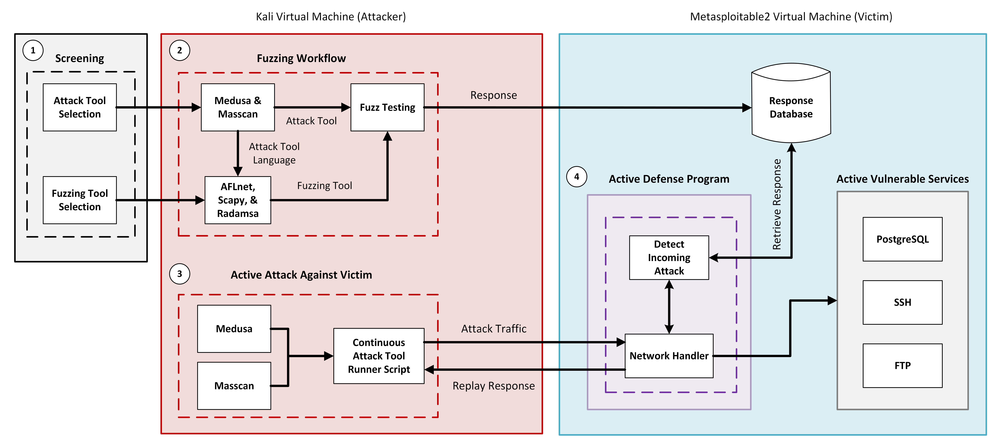

<!-- markdownlint-disable MD033 -->
<!-- markdownlint-disable MD029 -->

# Charger Active Defense v1.0 - Senior Design Project

<div style="text-align:center">

 <!-- *Noah Sickels, Adam Brannon, and William Lochte* -->


[](https://www.python.org/downloads)


</div>

## Table of Contents

- [Project Overview](#project-overview)
  - [Project Directory Structure](#project-directory-structure)
- [Prerequisites](#prerequisites)
- [Testbed Configuration](#testbed-configuration)
  - [Network Configuration](#network-configuration)
- [Usage & Installation](#usage--installation)
  - [Bash Script (Recommended)](#bash-script-recommended)
  - [Dockerfile *(WIP)*](#dockerfile-wip)
  - [Manual Installation (Recommended)](#manual-installation-recommended)
  - [Usage](#usage)
    - [Radamsa & Medusa](#radamsa--medusa)
    - [AFLnet & Masscan](#aflnet--masscan)
- [Demonstration Video](#demonstration-video)
- [References](#references)

## Project Overview

Our senior design group is the second team working on the Charger Active Defense project. This project aims to develop a fuzzing workflow that effectively tests the networking aspects of the selected target applications, Medusa and Masscan. We strive to identify any hangs or crashes that may occur, which can then be sent back to the host machine to potentially disrupt or halt the adversary’s tool.

This project is divided into two main phases - the fuzzing workflow and the active defense tool. The fuzzing workflow phase involves the selection of fuzzing tools, two attack tools to fuzz, and the development of a fuzzing workflow. The active defense tool phase involves the development of a tool that can detect and respond to attacks on the network and send the fuzzed responses back to the adversary's tool.

You can find the sponsor's project proposal slide below.

<div style="text-align:center">


</div>

### Charger Active Defense - System Overview Diagram



### Project Directory Structure

#### Highlights

- **User_Guide.docx:** User guide document for the project (MS Word formatted README).
- **workflow.sh:** Bash script for installing and building the attack and fuzzing tools for the workflow.
- **Dockerfile:** WIP Dockerfile for fuzzing workflow.
- **Makefile:** Makefile for building and running the Docker container.
- **Background Screening:** Contains CVEs, LDRA Static Analysis test results, and Valgrind test results for all attack tool candidates.
- **Config:** Contains configuration files for the testbed.
- **Deliverables:** Contains project deliverables, including reports, briefings, design review, and final report.
  - **G12_attack_tool_selection_report.docx**: Attack tool selection report.
  - **G12_fuzz_tool_selection_report.docx**: Fuzz tool selection report.
  - **G12_fuzzing_results_analysis.docx**: Fuzzing toolls compatibility testing results and analysis report.

- **Fuzzing:** Contains fuzzing-related files, including attack tool commands and fuzzing tool files.
  - **Attack_Tool_Commands.md:** Commands used for the attack tools.
  - **password_list.txt:** Password list used for testing.
  - **repeat_medusa.sh:** Script to repeatedly run Medusa.

<details>
<summary>Directory Tree</summary>

```plaintext
Charger Active Defense v1.0 - Senior Design Project
.
├── README.md
├── User_Guide.docx
|── Charger-Active-Defense-Banner.png
├── workflow.sh
├── Dockerfile
├── Makefile
├── project_overview.png
├── background_screening
|   ├── CVEs.md
│   ├── Attack_Tool_Info.md
|   ├── ldra
|   │   ├── aircrack-ng
|   │   │   └── aircrack-ng.mts.htm
|   │   ├── masscan
|   │   │   └── masscan.mts.htm
|   │   ├── medusa
|   │   │   └── medusa.mts.htm
|   │   ├── netdiscover
|   │   │   └── netdiscover.mts.htm
|   │   ├── reaver
|   │   │   └── reaver.mts.htm
|   │   └── yersinia
|   │       └── yersinia.mts.htm
|   └── valgrind
|       ├── commands.txt
|       ├── masscan.txt
|       ├── medusa_ftp.txt
|       ├── medusa_postgres.txt
|       ├── medusa_ssh.txt
|       └── netdiscover.txt
├── config
|   ├──network_configuration_assets
|   ├── configuration_table.md
|   ├── Configuration_Table.png
│   ├── Metasploitable2_Running_Services.txt
│   └── Testbed_Config.md
├── deliverables
│   ├── G12_attack_tool_selection_report.docx
│   ├── G12_fuzz_tool_selection_report.docx
│   ├── G12_fuzzing_results_analysis.docx
│   ├── briefings
│   │   ├── brief_1
│   │   │   ├── G12_briefing_1_progress_report.docx
│   │   ├── brief_2
│   │   │   ├── G12_briefing_2_progress_report.docx
│   │   │   └── fuzzowski_medusa_telnet.pcap
│   │   └── brief_3
│   │       └── G12_briefing_3_progress_report.docx
│   ├── design_review
│   │   ├── 495_488_design_review_template.pptx
│   │   ├── Behavioral_Decomposition.vsdx
│   │   ├── Functional_Decomposition.vsdx
│   │   ├── G12_design_review_presentation.pptx
│   │   ├── G12_level_of_effort.docx
│   │   ├── G12_marketing_requirements.docx
│   │   ├── Updated_Behavioral_Decomposition.png
│   │   ├── Updated_Functional_Decomposition.png
│   │   └── individual_level_of_effort.md
│   ├── final_report
│   ├── proposal
│   │   ├── ChAD Senior Design Project - rev 4.png
│   │   ├── G12_project_proposal.pptx 
│   │   ├── G12_project_proposal.pdf
│   │   └── Senior Design Project Gantt Chart.png
│   └── timeline_and_milestones
│       ├── G12_updated_milestones.docx
|       ├── G12_updated_timeline.png
│       ├── Project_Timeline_v2.gan
│       └── initial
│           ├── Project_Timeline_Proposal.gan
│           └── milestone_analysis.md
├── fuzzing
|   ├── Attack_Tool_Commands.md
|   ├── password_list.txt
|   ├── repeat_medusa.sh
│   ├── afl-qemu-trace
│   ├── fuzzowski.medusa.ftp
│   │   └── ftp.py
│   ├── fuzzshark
│   │   └── ~src
|   ├── icmp.masscan
│   │   ├── fuzz_ping.sh
│   │   ├── grammer.bnf
│   │   ├── internet_checksum.py
│   │   ├── requirements.txt
│   │   └── send_icmp.py 
│   ├── medusa.postgresql.afl_1
│   │   ├── cmdline
│   │   ├── fuzz_bitmap
│   │   ├── fuzzer_setup
│   │   ├── fuzzer_stats
│   │   ├── ~hangs
│   │   ├── init_attempt
│   │   │   ├── medusa_config.txt
│   │   │   ├── wrapper.c
│   │   │   └── wrapper.sh
│   │   ├── ~plot_data
│   │   └── ~queue
│   ├── peach_fuzz
│   │   ├── network_fuzzing.xml
│   │   └── peachfuzzer.dockerfile
│   ├── radamsa
│   │   ├── Radamsa_Instructions.md
│   │   └── ~img
│   ├── randbytes
│   │   ├── ftp_server.py
│   │   └── pcap_parsing.py
│   ├── randpkt
│   │   └── ~src
│   └── scapy.radamsa
│       └── radamsa_scapy_pcap_fuzzing.py
├── misc
|   ├── Charger-Active-Defense-Banner-old.png
|   ├── Conference-template-A4.doc
|   ├── generate_tree.py
|   └── project_directory_tree.txt
├── pcaps
│   ├── baseline
│   │   ├── masscan.pcap
│   │   ├── medusa_ftp.pcap
│   │   ├── medusa_postgresql.pcap
│   │   └── medusa_ssh.pcap
│   └── scapy
│       ├── ftp_login_packets.pcap
│       ├── fuzz_test_1.pcap
│       ├── medusa_ftp_brute_force.pcap
│       ├── medusa_ftp_fail.pcap
│       └── nmap_ftp_scan.pcap
├── project_overview.png
└── research
    ├── Fuzzing_Tools.md
    └── cmiller-csw-2010.pdf

```

<details>
<summary>Explanation</summary>

- **README.md:** This file.
- **User_Guide.docx:** User guide document for the project (MS Word formatted README).
- **Charger-Active-Defense-Banner.png:** Project banner image.
- **workflow.sh:** Bash script for installing and building the attack and fuzzing tools for the workflow.
- **Dockerfile:** WIP Dockerfile for fuzzing workflow.
- **Makefile:** Makefile for building and running the Docker container.
- **project_overview.png:** Image of the project overview.
- **background_screening:** Contains test-related files.
  - **CVEs.md:** List of CVEs from all attack tool candidates.
  - **Attack_Tool_Info.md:** Information about attack tools.
  - **ldra:** LDRA test files.
    - **aircrack-ng/aircrack-ng.mts.htm:** Aircrack-ng LDRA test files.
    - **masscan/masscan.mts.htm:** Masscan LDRA test files.
    - **medusa/medusa.mts.htm** Medusa LDRA test files.
    - **netdiscover/netdiscover.mts.htm:** Netdiscover LDRA test report.
    - **reaver/reaver.mts.htm:** Reaver LDRA test report.
    - **yersinia/yersinia.mts.htm:** Yersinia LDRA test report.
  - **valgrind:** Valgrind test results for each attack tool candidate.
    - **commands.txt:** Commands used for running the Valgrind tests.
    - **masscan.txt:** Masscan Valgrind test results file.
    - **medusa_ftp.txt:** Medusa FTP Valgrind test results file.
    - **medusa_postgres.txt:** Medusa PostgreSQL Valgrind test results file.
    - **medusa_ssh.txt:** Medusa SSH Valgrind test results file.
    - **netdiscover.txt:** Netdiscover Valgrind test results file.
- **project_overview.png:** Image of the project overview.
- **config:** Contains configuration files.
  - **network_configuration_assets:** Screenshots of VirtualBox Network adapter settings menus for README and User Guide.
  - **configuration_table.md:** Configuration table for the testbed (Markdown).
  - **Configuration_Table.png:** Configuration table for the testbed (PNG).
  - **Testbed_Config.md:** Configuration details for the testbed.
- **deliverables**: Contains project deliverables, including the tool reports, proposal presentation slides, briefings, design review, and final report.
  - **G12_attack_tool_selection_report.docx:** Attack tool selection report.
  - **G12_fuzz_tool_selection_report.docx:** Fuzz tool selection report.
  - **G12_fuzzing_results_analysis.docx:** Fuzzing results analysis.
  - **briefings:** Contains briefing files.
    - **brief_1:** Briefing 1 files.
      - **G12_briefing_1_progress_report.docx:** Briefing 1 progress report.
    - **brief_2:** Briefing 2 files.
      - **G12_briefing_2_progress_report.docx:** Briefing 2 progress report.
      - **fuzzowski_medusa_telnet.pcap:** Fuzzowski Medusa Telnet PCAP file.
    - **brief_3:** Briefing 3 files.
      - **G12_briefing_3_progress_report.docx:** Briefing 3 progress report.
  - **design_review:** Contains design review files.
    - **495_488_design_review_template.pptx:** Design review template.
    - **Behavioral_Decomposition.vsdx:** Behavioral decomposition Visio diagram.
    - **Functional_Decomposition.vsdx:** Functional decomposition Visio diagram.
    - **G12_design_review_presentation.pptx:** Design review presentation.
    - **G12_level_of_effort.docx:** Level of effort document.
    - **G12_marketing_requirements.docx:** Marketing requirements document.
    - **Updated_Behavioral_Decomposition.png:** Updated behavioral decomposition diagram image.
    - **Updated_Functional_Decomposition.png:** Updated functional decomposition diagram image.
    - **individual_level_of_effort.md:** Individual level of effort document.
  - **final_report:** Final report files.
  - **proposal:** Proposal files.
    - **ChAD Senior Design Project - rev 4.png:** Proposal overview diagram.
    - **G12_project_proposal.pptx:** Project proposal presentation slides.
    - **G12_project_proposal.pdf:** Project proposal PDF.
    - **Senior Design Project Gantt Chart.png:** Initial project timeline Gantt chart.
  - **timeline_and_milestones:** Contains timeline and milestones files.
    - **G12_updated_milestones.docx:** Updated milestones document for Design Review.
    - **G12_updated_timeline.png:** Updated timeline.
    - **Project_Timeline_v2.gan:** Gantt chart file for the project timeline.
    - **initial:** Initial timeline and milestones.
      - **Project_Timeline_Proposal.gan:** Initial project timeline proposal.
      - **milestone_analysis.md:** Milestone analysis.  
- **fuzzing:** Contains fuzzing-related files.
  - **Attack_Tool_Commands.md:** Commands used for the attack tools.
  - **password_list.txt:** Password list used for testing.
  - **repeat_medusa.sh:** Script to repeatedly run Medusa.
  - **afl-qemu-trace:** AFL QEMU trace binary.
  - **fuzzowski.medusa.ftp:** Fuzzowski Medusa FTP files.
    - **ftp.py:** FTP file for Fuzzowski Medusa.
  - **fuzzshark:** Fuzzshark files.
  - **medusa.postgresql.afl_1:** Medusa PostgreSQL AFL files.
    - **init_attempt:** Initial attempts with AFLnet.
      - **medusa_config.txt:** Medusa configuration file for wrapper.
      - **wrapper.c:** Custom wrapper source file.
      - **wrapper.sh:** Custom wrapper script.
  - **peach_fuzz:** Peach Fuzz files.
    - **network_fuzzing.xml:** Network fuzzing XML model file.
    - **peachfuzzer.dockerfile:** Peach Fuzzer Dockerfile.
  - **radamsa:** Radamsa files.
    - **Radamsa_Instructions.md:** Radamsa testing instructions.
  - **randbytes:** Randbytes files.
    - **ftp_server.py:** FTP server file.
    - **pcap_parsing.py:** PCAP parsing file with Scapy.
  - **randpkt:** Randpkt files.
  - **scapy.radamsa:** Scapy Radamsa files.
    - **radamsa_scapy_pcap_fuzzing.py:** Radamsa & Scapy PCAP fuzzing Python script.
- **misc:** Miscellaneous files.
  - **Charger-Active-Defense-Banner-old.png:** Old project banner.
  - **Conference-template-A4.doc:** IEEE conference template document.
  - **generate_tree.py:** Python script to generate the directory tree.
  - **project_directory_tree.txt:** Directory tree text file.
- **pcaps:** Contains PCAP files.
  - **baseline:** Baseline PCAP files.
  - **scapy:** Scapy PCAP files.
- **research:** Contains research-related files.
  - **Fuzzing_Tools.md:** Background research on possible fuzzing tools.
  - **cmiller-csw-2010.pdf:** Research paper on general fuzzing and fuzzing tools.

</details>
</details>

## Prerequisites

- VirtualBox 7.1.0 (or later)
- Kali Linux 2023.4 (or later) or Ubuntu 20.04 (or later)
- Wi-Fi/Ethernet Adapter that supports promiscuous mode.
- Packages: `clang`, `graphviz-dev`, `libcap-dev`, `git`, `make`, `gcc`, `autoconf`, `automake`, `libssl-dev`, `wget`, `curl`  

## Testbed Configuration

The Chad workflow testbed comprises two virtual machines: Kali Linux 2023.4 (or newer) and Metasploitable2. You can download a pre-built Kali Linux VM from their website [here](https://www.kali.org/get-kali/#kali-virtual-machines). Rapid7 provides a pre-built Metasploitable2 VM from their website [here](https://www.rapid7.com/products/metasploit/metasploitable/). For detailed configuration information, please refer to the table below.  

  

> [!IMPORTANT]\
> *"Virtual Machine 1 (Host)"* refers to the attacking virtual machine running Kali, which runs Medusa and Masscan against the target VM.\
> *"Virtual Machine 2 (Target)"* refers to the virtual machine running Metasploitable2, which has vulnerable services active.  

### Network Configuration

For both VMs to communicate with each other, you will need to configure the network adapters in VirtualBox and on the VMs' network interfaces. You can use either a physical network adapter that supports promiscuous mode or virtual adapters through your hypervisor; however, we recommend using the virtual adapters as shown below.

#### VirtualBox Network Adapter Settings Configuration

This will configure the network adapters for the Kali and Metasploitable2 VMs within VirtualBox through the internal network adapter.

##### Kali Virtual Machine

<details>

1. Open VirtualBox and select the Kali VM.
2. Click on the *Settings* icon and navigate to the *Network* tab.
3. Under *Adapter 1*, select *Attached to: NAT* (optional).
4. Click on *Adapter 2*.
5. Check the box for *Enable Network Adapter*.
6. Select *Attached to: Internal Network*.
7. In the *Name* field, enter `intnet`.
8. Click *OK* to save the settings and close out of the window.

</details>

> [!NOTE]\
> The NAT second adapter is optional and can be used to download packages and updates for the Kali VM. The internal network adapter is required as it is used for communication between the Kali and Metasploitable2 VMs.

##### Metasploitable2 Virtual Machine

<details>

1. Open VirtualBox and select the Metasploitable2 VM.
2. Click on the *Settings* icon and navigate to the *Network* tab.
3. Under *Adapter 1*, select *Attached to: Internal Network*.
4. In the *Name* field, enter `intnet`.
5. Click *OK* to save the settings and close out of the window.

</details>

<!-- #### Docker Network Configuration *(WIP)* -->

#### Host Machine Network Configuration

Once the virtual machines are configured, start both VMs and configure the network interfaces on each VM. Note that the network interface names may vary depending on the operating system and version.

We will use the default network interface names for the examples below. The IP addresses used are default private IP addresses, but you can use any IP address within the same subnet.

<details>

##### Kali Host Machine

Open terminal and run the following command(s) to check the network interfaces:

```bash
sudo ip addr
# or
sudo ifconfig
```

You should see the network interfaces listed. If you enabled network adapter 1, you should see your internet-facing network interface named `eth0` or `enp0s3`.

If you enabled network adapter 2, you should see an interface named `eth1` or `enp0s8`. Otherwise, you may need to manually configure the network interfaces on your system.

We will use `eth1` for the internal network communication as an example for the commands below.

Set the IP address for the internal network interface `eth1` (***requires root privileges***):

```bash
sudo ip addr add 192.168.1.99 dev eth1
# or
sudo ifconfig eth1 192.168.1.99
```

You can verify the IP address is set correctly by running `sudo ip addr` or `sudo ifconfig` again.

##### Metasploitable2 Target Machine

By default, the Metasploitable2 VM has no GUI and should boot into a terminal window. Verify the available network interfaces by running the following command(s):

```bash
sudo ip addr
# or
sudo ifconfig
```

You should see the network interface `eth0` listed. Set the IP address for the internal network interface `eth0` (***requires root privileges***):

```bash
sudo ip addr add 192.168.1.100 dev eth0
# or
sudo ifconfig eth0 192.168.1.100
```  

You can verify the IP address is set correctly by running `sudo ip addr` or `sudo ifconfig` again.

</details>

#### Verify Network Connection

Once the network interfaces have been configured on both VMs, you can test the network connection between the two VMs by running the following commands:

```bash
# On the Kali VM
ping 192.168.1.100

# On the Metasploitable2 VM
ping 192.168.1.99
```

If the network connection is successful, you should see the ping responses from the target VM (e.g., `64 bytes from 192.168.1.100: icmp_seq=1 ttl=64 time=0.171ms`).

If the connection is unsuccessful, restart the VMs and verify the network configurations. Network adapters may reset at times, so we recommend checking the network adapter IP addresses to ensure they are still set correctly.

If they are not set, you can reconfigure them by repeating the steps above.

## Usage & Installation

There are three ways to install and use the tools necessary for the Chadv1.0 workflow: using the Bash script, the Dockerfile, or manually.

### Bash Script (Recommended)

---

To install the attack tools and fuzzing tools, you can use the provided Bash script as shown below (***requires root privileges***):

```bash
# Download the workflow script through curl or manually from the repository
curl -O https://raw.githubusercontent.com/NCSickels/chadv1.0/main/workflow.sh

# Make the script executable
chmod u+x workflow.sh

# Using the workflow script
sudo ./workflow.sh --help

# To install all tools (attack and fuzzing)
sudo ./workflow.sh install

# To build all tools (attack and fuzzing)
sudo ./workflow.sh build
```

> [!NOTE]\
> If you encounter the error: *`-bash: ./workflow.sh: /bin/bash^M: bad interpreter: No such file or directory`*, it is due to the script being in DOS format on a UNIX system. To fix this, you can use the *`dos2unix`* command to convert the script to UNIX format. You can install it through Apt package manager using the command *`sudo apt install dos2unix`*.  

### Dockerfile *(WIP)*

---

> [!WARNING]\
> *Requires Docker and Make to be installed on the host machine. Docker Desktop is available [here.](https://www.docker.com/get-started/)*

The Chad workflow can also be run in a Docker container. The Docker implementation utilizes a Makefile and the `make` utility to build and run the Dockerfile in a streamlined manner.

- Build the Chadv1.0 Workflow Docker image: `make build`
- Run the Chadv1.0 Workflow Docker container: `make run`

Optionally, you can build the Docker image and run the container manually using the commands below.

#### Build the Docker Image

```bash
# Build the Docker image
docker build -t workflow .
```

#### Run the Docker Container

```bash
# Run the Docker container
docker run --rm -it --name workflow -v . workflow /bin/bash
```  

### Manual Installation (Recommended)

---

#### Clone the Repositories

```bash
# Clone the attack tool repositories
git clone https://salsa.debian.org/pkg-security-team/medusa.git 
git clone https://github.com/robertdavidgraham/masscan.git

# Clone the fuzzing tool repositories
git clone https://github.com/aflnet/aflnet.git
git clone https://gitlab.com/akihe/radamsa.git
```

#### Install Necessary Dependencies

```bash
sudo apt install -y clang graphviz-dev libcap-dev git make gcc autoconf automake libssl-dev wget curl
```

#### Build Attack Tools

```bash
# Build Medusa
cd medusa
./configure
make
make install
cd ..

# Build Masscan
cd masscan
# Optionally, can run `make -j` for faster compilation
make 
make install
cd ..
```

#### Build Fuzzing Tools

```bash
# Build AFLnet
cd aflnet
make clean all
cd llvm_mode
make
# If this command does not work, it most likely means that llvm-config is not in your PATH. If so, you can add it manually as shown below.
# It should be named something like llvm-config-6.0 in /usr/bin/
export LLVM_CONFIG=$(ls /usr/bin/llvm-config-* 2>/dev/null | head -n 1)
cd ../..
export AFLNET=$(pwd)/aflnet
export WORKDIR=$(pwd)
export PATH=$PATH:$AFLNET
export AFL_PATH=$AFLNET
cd ..

# Build Radamsa
cd radamsa
make
sudo make install
cd ..
```

This will install the necessary tools for the Chadv1.0 fuzzing workflow, including AFLnet, Radamsa, Medusa, and Masscan.  

### Usage

---

After all tools are installed and configured, you can run AFLnet or Radamsa alongside Medusa and Masscan. Due to resource limitations, we decided to pair one fuzzing tool with one attack tool. Specifically, AFLnet will be used to test Masscan, while Radamsa will be used to test Medusa.

#### Radamsa & Medusa

Radamsa provides two methods for fuzzing network services, allowing it to operate as either a TCP client or server. When used as a TCP server, it can intercept web traffic and fuzz it with random data before relaying it back to the specified IP address and port.

For demonstration purposes, we set up a simple PHP HTTP web server on the local host, operating on TCP port 8080, by following the steps below.

1. Create a directory named `www` and cd into it.
2. Create two separate files within the `www` directory, `index.html` and `http-request.txt`.
3. In the `index.html` file, use your text editor of choice and add the line: `<h1> Radamsa Test </h1>`. You will use this file to test the PHP server and ensure it is running and visible on the network.
4. In the `http-request.txt` file, add the HTTP header as shown below.

```http
GET / HTTP/1.1
Host: localhost:8080
User-Agent: Radamsa-Test
Accept: */*
```

5. Next, start the PHP server using the command php -S localhost:8080 within the same www directory.
6. Open a separate terminal session in your home directory and run the following command:

```bash
curl localhost:8080 
```

> [!IMPORTANT]\
> Do NOT close the first terminal session running the PHP server. This session must remain open to keep the PHP server running.

7. In your first terminal session window, you should see the contents of the index.html file in the PHP server logs. This output verifies that the PHP server is up and running.


8. In the same terminal where you ran the curl command, we will now use Radamsa and the known, good output from the http-request.txt file to send back to the PHP server. Use the command:

```bash
radamsa -o 127.0.0.1:8080 http-request.txt -n inf` 
```

9. Finally, view the output of the PHP server logs, and you'll see that it received the requests, but it will most likely not process them, as they were invalid/malformed.


Radamsa can also be used to fuzz network client applications by intercepting responses from a network service and modifying them before the client receives them. The steps below will guide you in setting up Radamsa and Medusa in this manner.

1. First, you must acquire sample output from Medusa as input data. Use the command below to run Medusa through PostgreSQL against a target and save the response to a text file. You can find the password_list.txt file under `chadv1.0/fuzzing/password_list.txt`.
  
```bash
medusa -h 192.168.1.100 -u postgres -P password_list.txt -M postgres -n 5432 > medusa_output.txt
```

2. Next, open a separate terminal session and run the command below. This command will set up Radamsa as a server that will send the fuzzed versions of Medusa's output in response.
  
```bash
radamsa -o :5432 medusa_output.txt -n inf
```

3. Finally, using the repetition script (`chadv1.0/fuzzing/repeat_medusa.sh`), run Medusa against the Metasploitable2 target VM. The script allows Medusa to run while Radamsa is running against it continually; Radamsa offers an "infinite" flag (`inf`), but Medusa does not.
4. The responses will be sample data fuzzed by Radamsa.

#### AFLnet & Masscan

The process for running AFLnet and Masscan is far more streamlined than the initial Radamsa and Medusa setup, as we do most of the configuration in the workflow script.

1. After running the workflow script, you should see a folder named `chadv1.0`. In it, you'll see two folders - `attack_tools` and `fuzzing_tools`.
2. Navigate to the `fuzzing_tools/aflnet` directory: `cd fuzzing_tools/aflnet`.
3. Next, in the `aflnet` directory, we will create two folders: `in` and `out`. Use the command(s): `mkdir in` and `mkdir out`. These folders are required for AFLnet to store known good commands for Masscan and the output of our fuzz testing results.
4. Next, you will need to get the MAC address of your ethernet/wi-fi adapter on your VirtualBox system. Type the command `ip addr`. You should see a list of your available adapters on your system. Use the same adapter you configured previously with the Internal Network. You will find your MAC address to the right of the line starting with `link/ether`. If you have more than one and are unsure, refer to the [Network Configuration](#network-configuration) section above.
5. Next, follow the commands below to put the Masscan commands in respective tests files in the in directory.

```bash
# Scan 1 File
echo “masscan -p21-8180 192.168.1.100 --banners --packet-trace --source-mac <YOUR_MAC_ADDRESS>” > scan1.txt

# Scan 2 File
echo “masscan -p80,443 192.168.1.100 –banners” > scan2.txt

# Scan 3 File
echo “masscan -p1-65535 192.168.1.100 --rate=1000” > scan3.txt
```

6. Finally, navigate to AFLnet’s root directory (chadv1.0/fuzzing_tools/aflnet) and run the command below. This command will start AFLnet fuzzing on Masscan.
  
```bash
./afl-fuzz -t 1200 -i in -o out -N tcp://192.168.1.100/22 -P SSH masscan -p21-8180 192.168.1.100 --banners --packet-trace  --source-mac <MAC_ADDRESS>
```

> [!WARNING]\
> You will need to replace the `<MAC_ADDRESS>` with your adapter’s MAC address for steps 5 & 6!

## Demonstration Video

[](https://www.youtube.com/watch?v=pf5AnudsbNgE)

## References

### Attack Tools

- [Medusa](https://salsa.debian.org/pkg-security-team/medusa)
- [Masscan](https://github.com/robertdavidgraham/masscan.git)

### Fuzzing Tools

- [AFLnet](https://github.com/aflnet/aflnet)
- [Radamsa](https://gitlab.com/akihe/radamsa.git)

### Testbed Tools

- [VirtualBox](https://www.virtualbox.org/wiki/Downloads)
- [Docker Desktop](https://www.docker.com/get-started/)
- [Kali Linux 2023.4 Pre-built VMs](https://www.kali.org/get-kali/#kali-virtual-machines)
- [Ubuntu 20.04 LTS ISO](https://releases.ubuntu.com/focal/)
- [Metasploitable2](https://www.rapid7.com/products/metasploit/metasploitable/)

### Miscellaneous Tools

- [dos2unix](https://dos2unix.sourceforge.io)
- [Valgrind](https://valgrind.org)
- [LDRA](https://ldra.com)
- [MD to DOCX Converter (Used for creating user guide)](https://cloudconvert.com/md-to-docx)
