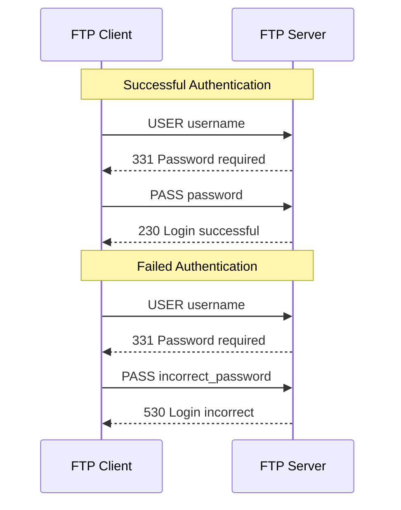
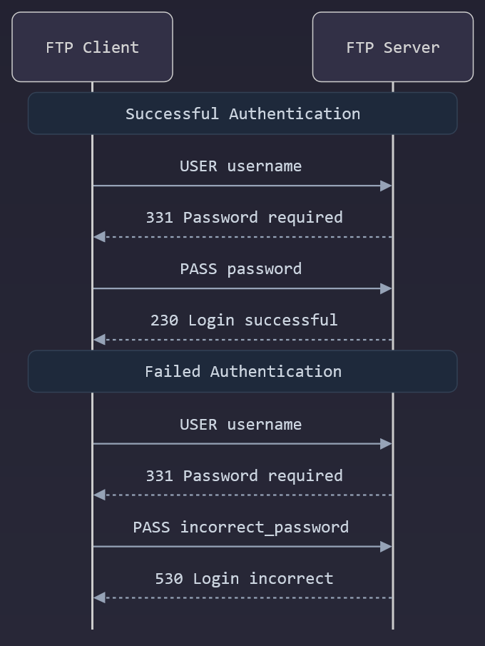

# Results of Password Brute Forcer Prompt for Phind Model

## FTP Diagram

### Mermaid Markdown Source



### Diagram - Rendered Image



## Initial Prompt Source Code

- From this prompt, the Phind model provided a program where the program would act as an FTP server and check the password of a client connecting to it instead of the intended password "checker" where the program would check the password against the FTP server.

```c
#include <stdio.h>
#include <stdlib.h>
#include <string.h>
#include <sys/socket.h>
#include <netinet/in.h>
#include <arpa/inet.h>

#define BUFFER_SIZE 1024
#define MAX_CLIENTS 10
#define PORT 21

// Structure to store client information
typedef struct {
    int socket;
    char username[BUFFER_SIZE];
    int authenticated;
} client_t;

// Function prototypes
void handle_client(int client_socket);
char* get_response(int status);
int verify_credentials(const char* username, const char* password);

int main() {
    int server_fd, client_fd;
    struct sockaddr_in server_addr, client_addr;
    socklen_t client_len = sizeof(client_addr);
    
    // Create server socket
    server_fd = socket(AF_INET, SOCK_STREAM, 0);
    if (server_fd < 0) {
        perror("socket creation failed");
        return 1;
    }

    // Set address and port number for the server
    server_addr.sin_family = AF_INET;
    server_addr.sin_port = htons(PORT);
    inet_pton(AF_INET, "127.0.0.1", &server_addr.sin_addr);

    // Bind the socket to the port
    if (bind(server_fd, (struct sockaddr*)&server_addr, sizeof(server_addr)) < 0) {
        perror("bind failed");
        return 1;
    }

    // Listen for connections
    if (listen(server_fd, MAX_CLIENTS) < 0) {
        perror("listen failed");
        return 1;
    }

    printf("FTP server listening on port %d...\n", PORT);

    while(1) {
        // Accept incoming connections
        client_fd = accept(server_fd, (struct sockaddr*)&client_addr, &client_len);
        if (client_fd < 0) {
            perror("accept failed");
            continue;
        }

        // Handle client in separate function
        handle_client(client_fd);
        
        // Close client socket
        close(client_fd);
    }

    return 0;
}

void handle_client(int client_socket) {
    char buffer[BUFFER_SIZE];
    char username[BUFFER_SIZE] = {0};
    char password[BUFFER_SIZE] = {0};
    int authenticated = 0;

    // Send initial welcome message
    send(client_socket, "220 Welcome to FTP server\r\n", strlen("220 Welcome to FTP server\r\n"), 0);

    while(1) {
        // Receive command from client
        memset(buffer, 0, BUFFER_SIZE);
        recv(client_socket, buffer, BUFFER_SIZE - 1, 0);

        // Parse command
        if(strncmp(buffer, "USER ", 5) == 0) {
            strncpy(username, buffer + 5, strlen(buffer) - 5);
            username[strlen(username) - 2] = '\0'; // Remove \r\n
            
            char response[100];
            sprintf(response, "331 User %s, password required\r\n", username);
            send(client_socket, response, strlen(response), 0);
            
        } else if(strncmp(buffer, "PASS ", 5) == 0) {
            strncpy(password, buffer + 5, strlen(buffer) - 5);
            password[strlen(password) - 2] = '\0'; // Remove \r\n
            
            authenticated = verify_credentials(username, password);
            
            if(authenticated) {
                send(client_socket, "230 User logged in\r\n", strlen("230 User logged in\r\n"), 0);
            } else {
                send(client_socket, "530 Login incorrect\r\n", strlen("530 Login incorrect\r\n"), 0);
            }
            
        } else if(strcmp(buffer, "QUIT\r\n") == 0) {
            send(client_socket, "221 Goodbye\r\n", strlen("221 Goodbye\r\n"), 0);
            break;
        }
    }
}

// Simple credential verification function
int verify_credentials(const char* username, const char* password) {
    // In production, this would typically check against a database
    // Here we use hardcoded values for demonstration
    return strcmp(username, "test_user") == 0 && 
           strcmp(password, "test_password") == 0;
}
```

## Refinement Source Code

```c
#include <stdio.h>
#include <stdlib.h>
#include <string.h>
#include <sys/socket.h>
#include <netinet/in.h>
#include <arpa/inet.h>

#define BUFFER_SIZE 1024
#define MAX_CLIENTS 10
#define PORT 21

// Structure to store client information
typedef struct {
    int socket;
    char username[BUFFER_SIZE];
    int authenticated;
} client_t;

// Function prototypes
void handle_client(int client_socket);
char* get_response(int status);
int verify_credentials(const char* username, const char* password);

int main() {
    int server_fd, client_fd;
    struct sockaddr_in server_addr, client_addr;
    socklen_t client_len = sizeof(client_addr);
    
    // Create server socket
    server_fd = socket(AF_INET, SOCK_STREAM, 0);
    if (server_fd < 0) {
        perror("socket creation failed");
        return 1;
    }

    // Set address and port number for the server
    server_addr.sin_family = AF_INET;
    server_addr.sin_port = htons(PORT);
    inet_pton(AF_INET, "127.0.0.1", &server_addr.sin_addr);

    // Bind the socket to the port
    if (bind(server_fd, (struct sockaddr*)&server_addr, sizeof(server_addr)) < 0) {
        perror("bind failed");
        return 1;
    }

    // Listen for connections
    if (listen(server_fd, MAX_CLIENTS) < 0) {
        perror("listen failed");
        return 1;
    }

    printf("FTP server listening on port %d...\n", PORT);

    while(1) {
        // Accept incoming connections
        client_fd = accept(server_fd, (struct sockaddr*)&client_addr, &client_len);
        if (client_fd < 0) {
            perror("accept failed");
            continue;
        }

        // Handle client in separate function
        handle_client(client_fd);
        
        // Close client socket
        close(client_fd);
    }

    return 0;
}

void handle_client(int client_socket) {
    char buffer[BUFFER_SIZE];
    char username[BUFFER_SIZE] = {0};
    char password[BUFFER_SIZE] = {0};
    int authenticated = 0;

    // Send initial welcome message
    send(client_socket, "220 Welcome to FTP server\r\n", strlen("220 Welcome to FTP server\r\n"), 0);

    while(1) {
        // Receive command from client
        memset(buffer, 0, BUFFER_SIZE);
        recv(client_socket, buffer, BUFFER_SIZE - 1, 0);

        // Parse command
        if(strncmp(buffer, "USER ", 5) == 0) {
            strncpy(username, buffer + 5, strlen(buffer) - 5);
            username[strlen(username) - 2] = '\0'; // Remove \r\n
            
            char response[100];
            sprintf(response, "331 User %s, password required\r\n", username);
            send(client_socket, response, strlen(response), 0);
            
        } else if(strncmp(buffer, "PASS ", 5) == 0) {
            strncpy(password, buffer + 5, strlen(buffer) - 5);
            password[strlen(password) - 2] = '\0'; // Remove \r\n
            
            authenticated = verify_credentials(username, password);
            
            if(authenticated) {
                send(client_socket, "230 User logged in\r\n", strlen("230 User logged in\r\n"), 0);
            } else {
                send(client_socket, "530 Login incorrect\r\n", strlen("530 Login incorrect\r\n"), 0);
            }
            
        } else if(strcmp(buffer, "QUIT\r\n") == 0) {
            send(client_socket, "221 Goodbye\r\n", strlen("221 Goodbye\r\n"), 0);
            break;
        }
    }
}

// Simple credential verification function
int verify_credentials(const char* username, const char* password) {
    // In production, this would typically check against a database
    // Here we use hardcoded values for demonstration
    return strcmp(username, "test_user") == 0 && 
           strcmp(password, "test_password") == 0;
}
```
